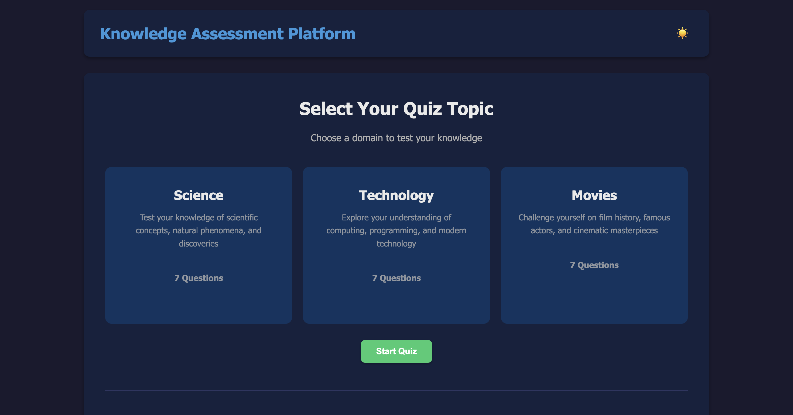
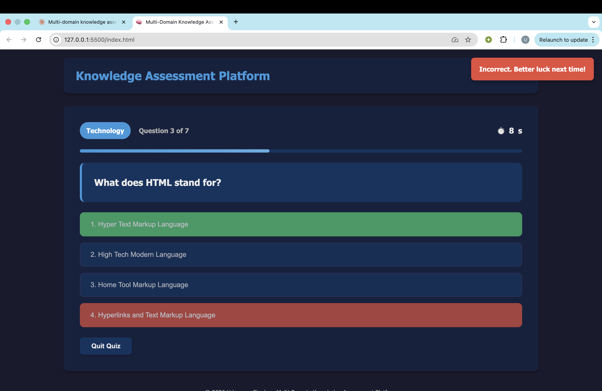
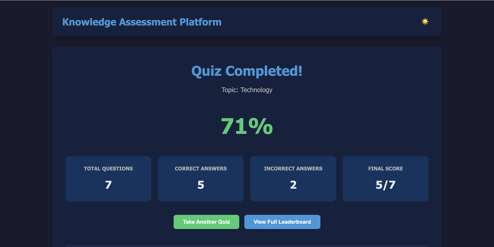
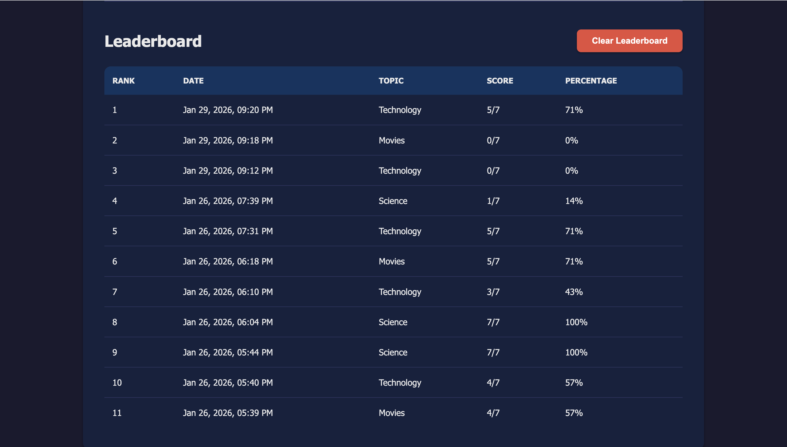

```md
# Multi-Domain Knowledge Assessment Platform

## Project Description
The **Multi-Domain Knowledge Assessment Platform** is a client-side quiz application built using **Vanilla JavaScript, HTML, and CSS**. The project demonstrates dynamic DOM manipulation, event-driven programming, client-side state management, and browser-based persistence using LocalStorage. Users can take timed quizzes across multiple topics, view real-time results, and track performance using a persistent leaderboard.

---

## Problem Statement
Students and learners often lack a simple interactive platform to assess their knowledge across different domains. Existing platforms are either complex or require backend infrastructure. This project provides a lightweight, browser-based solution for knowledge assessment with real-time feedback and performance tracking, implemented entirely on the client side.

---

## Features Implemented
- Multi-topic quiz system (Science, Technology, Movies)
- Timed quiz with automatic question progression
- Real-time scoring and result analysis
- Leaderboard with LocalStorage persistence
- Leaderboard ranking based on highest score and percentage
- Leaderboard preview on the home screen
- Dark mode toggle with saved preference
- Keyboard shortcuts (1–4 keys to select answers)
- Toast notifications for user feedback
- Edge case handling (no topic selected, time expiry, duplicate answers, empty leaderboard)
- Responsive and clean UI using Flexbox/Grid

---

## DOM Concepts Used
- Dynamic element creation using `document.createElement()`
- Dynamic content rendering and screen switching using JavaScript
- Event-driven DOM updates (click, keyboard, timer events)
- Event delegation for answer option handling
- Conditional rendering based on application state
- CSS class manipulation for UI feedback (correct/incorrect answers, dark mode)
- Inline style updates (progress bar, timer warning states)

---

## Steps to Run the Project
1. Clone or download the repository.
2. Open the project folder.
3. Open `index.html` in any modern web browser (Chrome, Edge, Firefox).
4. Select a topic and start the quiz.
5. View results and leaderboard after completing the quiz.

No additional dependencies or build tools are required.

---

## Screenshots

> Add screenshots of your application here to demonstrate the UI and features.

### Home Screen (Topic Selection & Leaderboard Preview)


### Quiz Interface (Question, Timer, Progress Bar)


### Results Screen


### Leaderboard Screen



**How to add screenshots:**
1. Create a folder named `screenshots` in the repository root.
2. Take screenshots of your app while running in the browser.
3. Save them as `home-screen.png`, `quiz-screen.png`, and `results-screen.png` (or update the file names above).

---

## Known Limitations
- The project is fully client-side and does not use a backend database.
- Leaderboard data is stored only in browser LocalStorage and will reset if browser storage is cleared.
- Questions are static and predefined in the JavaScript file.
- No user authentication or multi-user support is implemented.

---

## Author
**Udayveer Singh**  
Web Dev II Final Project
```
